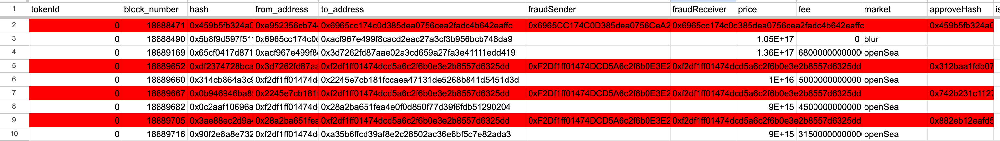

# 👣 Exodus from Egypt

## <mark style="color:red;">Passover</mark>

Coming soon...

### INSC+

As is widely acknowledged, **INSC** represents the first-ever inscription on the Ethereum **Virtual Machine (EVM)** in history. It innovatively employs smart contract event data to store inscription information, thereby ensuring its permanent presence on the Ethereum blockchain. Moreover, this approach guarantees decentralization and significantly enhances the programmability of inscriptions, unlocking a broader spectrum of application scenarios.

**INSC**, as an experimental product 🧪, was quite successful. However, since it had never been tested nor audited by any third-party auditing firm, the experiment eventually exploded 💥, resulting in injuries to many people. From another perspective, the results of this experiment suggest that the new EVM inscription ecosystem could potentially flourish. Users have shown immense interest and enthusiasm for INSC, which has far exceeded our expectations.&#x20;

To further promote the prosperity of the EVM inscription ecosystem, we are about to launch **INSC Plus(INSC+)**. **INSC+** is the first practical application of [**ERC7583**](https://github.com/insevm/ERCs/blob/master/ERCS/erc-7583.md) and the first perfect fusion of **ERC20** and **ERC721** tokens.

**INSC+** inherits the characteristic of using EVM's Event data to store inscription data. And it allows for the coexistence of both ERC721 and ERC20 token feature and functionalities. Users will be able to trade INSC+ simultaneously on Opensea and Uniswap.

We have conducted comprehensive testing on **INSC+** and invited third-party audit firm to audit **INSC+**. To prevent others from stealing our hard work, the contract code and audit report will be published before the activation of **INSC+** inscriptions.

As you might imagine, **INSC+** will pioneer a new form of asset, completely breaking down the barriers between fungible tokens (FT) and non-fungible tokens (NFT). This will link the prices in NFT markets with those in decentralized exchanges, leading to a new understanding of decentralized finance.

## Refund

### What is the meaning of 'refund'?

In the crypto industry, hacking incidents often occur, with the most influential one even leading to the fork of Ethereum. **INSC** also suffered a hacker attack. In dealing with this attack, we decided to draw wisdom from history. The purpose of Ethereum's fork was to roll back transactions to the state before the attack. Similarly, we decided to capture the pre-attack state through snapshots and map it onto **INSC+**.

However, there is still a flaw in this approach. If user A sells his **INSC** after the block where the snapshot is taken, then A would receive the proceeds from selling **INSC** and also obtain **INSC+**, effectively resulting in double spending. Double spending is a fundamental issue that all cryptocurrencies need to address. As a decentralized application, **INS.EVM** should not allow the occurrence of double spending.

Therefore, **'Refund'** refers to the following: All users who sold **INSC** after the block number of the **snapshot(18888329)** and before the **cutoff block(18891329, voted by** [**X**](https://twitter.com/ins\_evm/status/1746328180942946541)**)**, if they wish to obtain the eligibility to claim corresponding **INSC+**, must return the proceeds from the sale to prove themselves as loyal crew members.

### Who needs to perform the 'Refund'?

We have organized all the transaction data in this [sheet](https://docs.google.com/spreadsheets/d/19daoHmQl4FrSJlZL5IkbzNBWm64M0NbfVPFC\_a1mslA/edit?usp=sharing). The transactions in this [sheet](https://docs.google.com/spreadsheets/d/19daoHmQl4FrSJlZL5IkbzNBWm64M0NbfVPFC\_a1mslA/edit?usp=sharing) for each tokenId of **INSC** include: regular transfer transactions, NFT Market buy and sell transactions, and transactions stolen by hackers. The cutoff block of this [sheet](https://docs.google.com/spreadsheets/d/19daoHmQl4FrSJlZL5IkbzNBWm64M0NbfVPFC\_a1mslA/edit?usp=sharing) data is 18910071.

The rows in red represent the transaction records that were stolen:

<figure><figcaption></figcaption></figure>

Based on the transaction track of each tokenId, we have divided the tokenIds into two categories.

#### 1st category: Owners in the snapshot who never sold their INSC within 10 hours after the attack occurred

For this category of tokenIds, the eligibility to claim INSC+ will be directly granted to the Owners in the snapshot. This includes two scenarios: those who were unable to sell due to theft, and those who continuously held onto it (neither stolen nor sold).

Take for example tokenId 3, which was stolen right from the start. Therefore, the owner in the snapshot (0xc630b23073158fb77de5f315d12a9e2602800af9) couldn't sell it, so he will directly obtain the eligibility to claim **INSC+** for tokenId 3, need not refund.

<figure><figcaption></figcaption></figure>

#### 2st category: Owners in the snapshot who sold their INSC within 10 hours after the attack occurred

For instance, tokenId 203, where the owner in the snapshot successfully sold it after block **18888315**. Therefore, they need to return the proceeds from the sale in order to obtain the eligibility to claim **INSC+** for tokenId 203. The refund amount is **0.0088 ETH** (The sheet uses scientific notation, representing 8.8 \* 10^15 wei, where 1 ETH = 10^18 wei, so it is 0.0088 ETH).

<figure><figcaption></figcaption></figure>

We have organized the Level 1 Refund data in this table. Please review it carefully, and if you think there are any inaccuracies in the data, please submit through [this Google form](https://forms.gle/fCZHqN1LFxfeUBQ9A).

### What are the rules for 'refund'?

We can summarize the trade track model as shown in the following diagram:

<figure><figcaption>
After the attack event, A sold to B. B sold to C,and C was stolen.
</figcaption></figure>

The first level(A) will have 36 hours to decide whether to refund or not, with a default choice of refusal after time expiry. The second level (B) has 18 hours to choose, and the next level (C) only has 9 hours. If the next level (C) user could not sell due to theft, they will directly receive eligibility to claim **INSC+**.

Let's take the example of tokenId 1805. The trade track of this tokenId perfectly fits the structure of the above diagram.

<figure><figcaption></figcaption></figure>

The row marked in the diagram indicates the first buy-sell transaction that occurred after the snapshot. **0x01c80b45ba04fab5680864b9db3d4074f817de91** is A, **0x8b0ba677cd4a9833128796fe3ad90db2076596d1** is B and **0xe22c1d3b82b028eb0ddf481f64df9a077c25278e** is C.&#x20;

Initially, **0x01c80b45ba04fab5680864b9db3d4074f817de91** has 36 hours to choose to refund 0.1 ETH(0.1 ETH - 0ETH). If **0x01c80b45ba04fab5680864b9db3d4074f817de91** does not refund within the stipulated time, **0x01c80b45ba04fab5680864b9db3d4074f817de91** will lose the eligibility to claim **INSC+** and the option will be given to **0x8b0ba677cd4a9833128796fe3ad90db2076596d1**.

**0x8b0ba677cd4a9833128796fe3ad90db2076596d1** has 18 hours to choose to refund **0.00577ETH**(0.0058 ETH - 0.00002925 ETH). If **0x8b0ba677cd4a9833128796fe3ad90db2076596d1** does not refund within the specified time, **0xe22c1d3b82b028eb0ddf481f64df9a077c25278e** will directly obtain the eligibility to claim INSC+. Because **0xe22c1d3b82b028eb0ddf481f64df9a077c25278e**'s INSC was stolen.

### How much money should be refunded?

Refund amount = Price - Fee.&#x20;

## Compensation

Coming soon...

