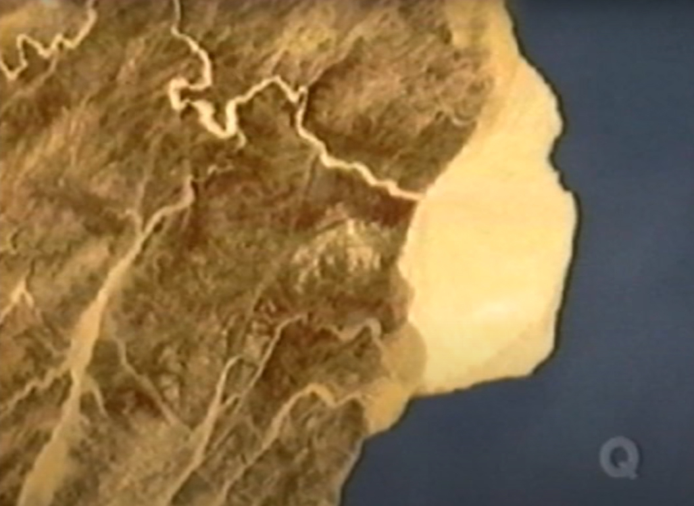

# Passover

## About the Exodus(Shamot)

The second book of the Bible, Exodus, is known as "Shemot" (meaning "Name") in the Torah. The core focus of this book is the name YHVH, who aims to establish and proclaim His name through all the wonders He performs in Egypt. He is omnipresent, and none of the gods worshiped by the Egyptians can compare to Him.

Some say that YHVH intentionally hardened Pharaoh's heart, which seems unfair to Pharaoh. The term "hardened" in the original Hebrew text means "strengthened." Here, YHVH deliberately allowed Pharaoh's heart not to be swayed by fear, enabling him to make a true choice from within. The term "strengthened" is also what we refer to in the context of the INSC attack incident.

## Passover

Before the plague of the death of the firstborn, YHVH began to instruct Moses about the regulations of Passover.&#x20;

Firstly, YHVH designated that month as the first month, marking the beginning of the year.

### The Plague of the Death of the Firstborn

On the tenth day, a lamb must be prepared, and at twilight on the fourteenth day, it is to be slaughtered, with its blood applied to the doorposts and the sides of the doorframes. The Israelite calendar is lunar-based, similar to the traditional Chinese calendar. For the Israelites, the evening marks the start of a new day, with dusk being the transition between the first and second day. Therefore, this act is carried out at the end of the fourteenth day; as the sun sets, it becomes the fifteenth day, the first day of Passover.

On that night, the fifteenth day, the lamb is to be eaten. It should be roasted over fire, along with unleavened bread and bitter herbs. It must not be eaten raw or boiled in water, but roasted with its head, legs, and inner parts. Nothing of it should be left until morning; if any remains, it must be burned. While eating, one should be dressed for travel, with a belt around the waist, sandals on feet, and a staff in hand, ready to leave quickly. One must not leave the house until morning.

<figure><figcaption></figcaption></figure>

On the evening of the fifteenth day, the angel of death struck down all the firstborn in Egypt, both human and animal. The blood on the doorposts and frames was a sign; wherever it was seen, the angel passed over that house. YHVH commanded the Israelites to commemorate this day for generations. When children ask about the meaning of this ritual, the Israelites are to explain it as a sacrifice to YHVH for Passover, when He struck down the Egyptians but spared the Israelites in their homes.

That night was marked by the cries of mourning throughout Egypt. Pharaoh summoned Moses and Aaron during the night, urging the Israelites to leave Egypt quickly, as the Egyptians feared they too might die. The Israelites requested gold, silver, and clothing from the Egyptians, who willingly gave what was asked, hastening their departure. Thus, the Israelites began their journey out of Egypt.

### The Feast of Unleavened Bread

Because the Israelites were urgently pressed by the Egyptians, they didn't have time to prepare food for themselves. They could only use unleavened raw flour to bake unleavened bread, serving as their food for the journey.

<figure><figcaption></figcaption></figure>

YHVH commanded the Israelites to eat unleavened bread for seven days, and on the first day, they were to remove leaven from their homes. For a full seven days, there should be no leaven in their houses. This starts from the evening of the 14th day of the first month at sunset and ends on the evening of the 21st day at sunset. During this period, the Israelites are to eat unleavened bread, and they would conduct a thorough cleaning in their homes as Passover approaches.

The first and seventh days should be sacred assemblies.

### Crossing the Red Sea

After the Israelites left Egypt, YHVH led them at night with a pillar of fire, providing warmth, and during the day with a pillar of cloud to shield them from the harsh sun. However, the route YHVH led the Israelites on was peculiar, as if they were moving in circles, eventually encamping at Pi-hahiroth, between Migdol and the sea, opposite Baal-zephon, near the sea.

<figure><figcaption>
Geographical Image of the Israelites' Encampment Site
</figcaption></figure>

From the topographic map, we can see that at this location, the Israelites were unable to escape and could be easily encircled by the Egyptians. On this plain, the Egyptian chariots could easily overpower the Israelite army. At this time, someone informed Pharaoh that the people were fleeing, so Pharaoh sent his chariots and army to pursue the Israelites.

Moses said to Pharaoh that the Israelites needed to travel for three days into the wilderness to hold a festival for YHVH (since it approximately takes three days to travel from Egypt to Mount Sinai). However, Pharaoh thought that the Israelites would only wander in the wilderness for three days. Here, it seems as though YHVH was playing a word game with Pharaoh, and He already knew that Pharaoh would focus only on the duration of three days, not the journey. Therefore, when Pharaoh discovered that the Israelites had been in the wilderness for three days without holding a festival for YHVH, he might have thought that YHVH had abandoned them, or that the events that had occurred were mere coincidences and not related to YHVH.

When the Egyptian army caught up with the Israelites, YHVH parted the Red Sea, revealing dry land, and the Israelites began to walk through the Red Sea. The Egyptian army followed suit in pursuit.&#x20;

<figure><figcaption></figcaption></figure>

YHVH positioned the pillar of cloud between the Egyptian army and the Israelites, preventing the Egyptians from getting close to the Israelites. At the same time, the pillar of fire led the Israelites through the Red Sea, creating a contrast of darkness on one side and light on the other.

<figure><figcaption></figcaption></figure>

At dawn, YHVH instructed Moses to stretch out his staff over the sea, and the waters returned to their normal state, engulfing the entire Egyptian army, leaving none of them behind.\

Below are the on-site investigation pictures of that location in the Red Sea:

<figure><figcaption>
Coral reefs grown on chariot wheels (made of gold)
</figcaption></figure>

<figure><figcaption>
Underwater pharaoh's chariot wheels (made of gold)
</figcaption></figure>

<figure><figcaption>
Sonar Survey of the Seabed Topography
</figcaption></figure>

